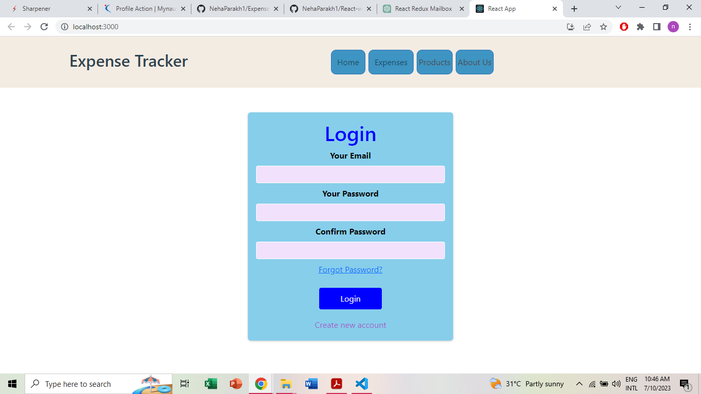
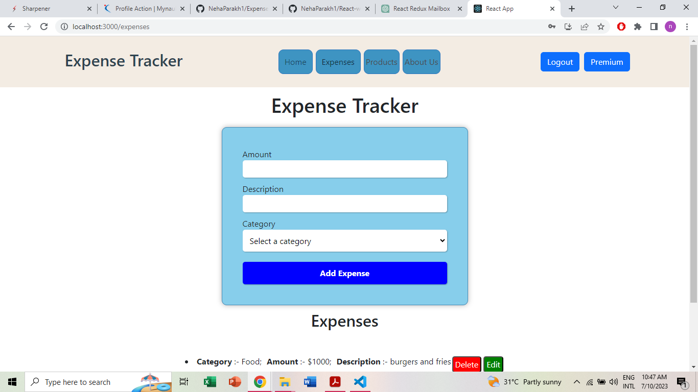
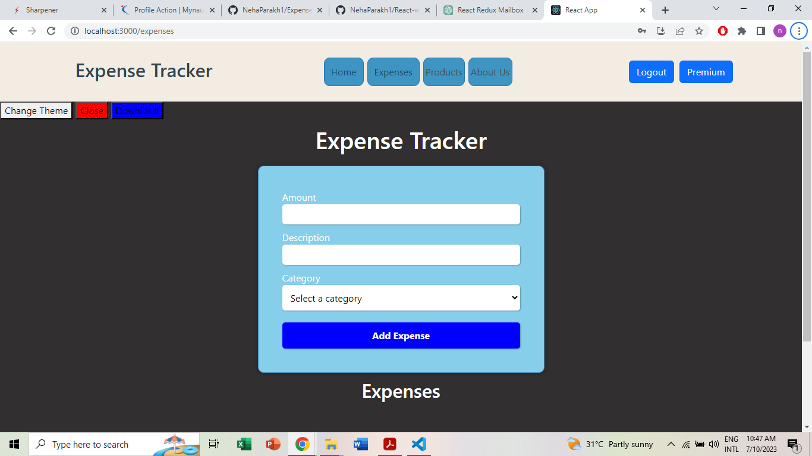
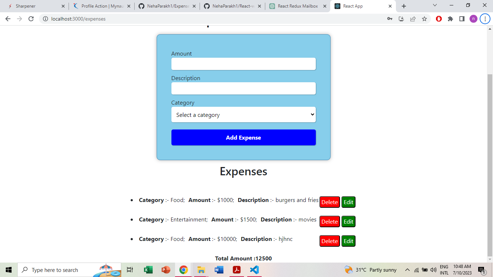

# Expense Tracker

The Expense Tracker App is a user-specific application built using React and Redux. It helps users track their expenses and provides a premium feature that allows them to change the app theme between dark and light modes. Additionally, users can download their expense data for further analysis.

# Features

1. Each user has their own expense tracking functionality, ensuring privacy and personalized data management.
2. Users can log their expenses, including details such as category, description, and amount spent.
3. When the total expense amount exceeds 10,000, users gain access to a premium feature that allows them to switch between dark and light app themes.
4. In premium feature, user can also download their expense data, enabling further analysis orrecord keeping.

# Technologies Used

1. React
2. Redux
3. HTML
4. CSS
5. RESTful APIs

# Usage

1. Sign in with your credentials or create a new account if you don't have one.
2. Navigate through the app to log your expenses.
3. If your total expenses exceed 10,000, you will gain access to the premium feature that allows you to switch between dark and light themes and also download the expense data.
4. Analyze your spending patterns, manage your expenses effectively, and enjoy the convenience of the Expense Tracker App.

# Demo

https://expense-tracker-beta-two.vercel.app/

# Images of app

